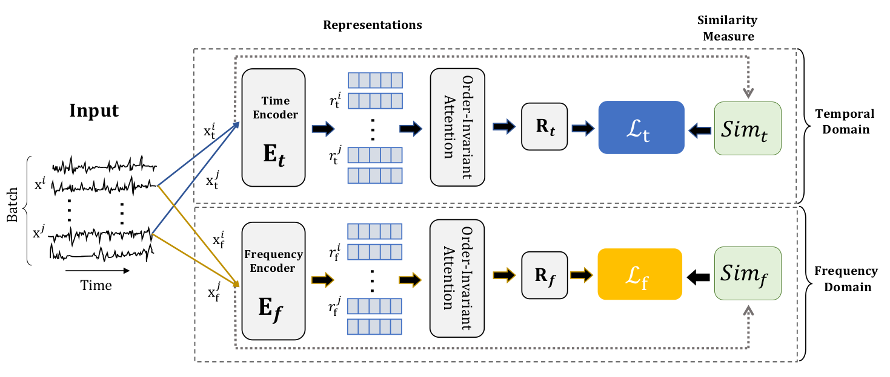

# Series2Vec Test
This is a PyTorch implementation of
**Series2Vec: Similarity-based Self-supervised Representation Learning for Time Series Classification**.
### Code Update: [22.03.2024]
#### Note:
If you downloaded the code prior to the latest update, please ensure to update to the current version as it is consistent with the paper.

    

 

### Get data from UEA Archive and HAR and Ford Challenge
Download dataset files and place them into the specified folder
UEA: [Here](https://www.timeseriesclassification.com/aeon-toolkit/Archives/Multivariate2018_ts.zip)

Copy the datasets folder to: Datasets/UEA/

## Setup

_Instructions refer to Unix-based systems (e.g. Linux, MacOS)._

This code has been tested with `Python 3.7` and `3.8`.

`pip install -r requirements.txt`

## Run

